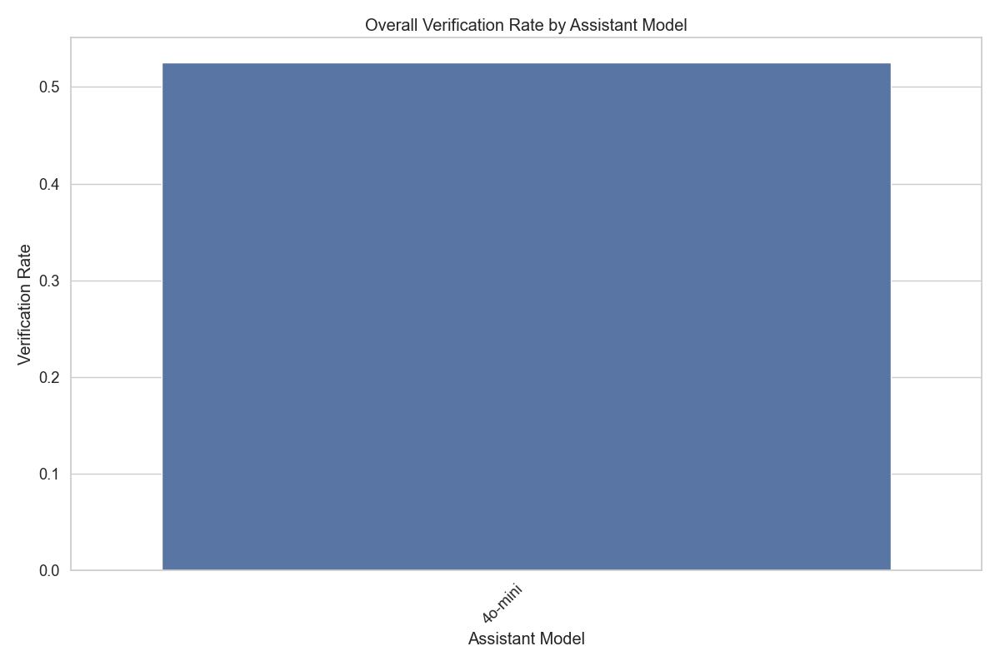

# Assistant Fine-Tuning Performance Analysis

This document summarizes the results of fine-tuning experiments for generating formal postconditions for smart contracts using different GPT models. The analysis is based on 80 total runs.

## Overall Performance Analysis

This section presents the overall success rates of each model across all tasks. Success is defined as generating postconditions that pass verification.

**Total Runs Analyzed:** 80

**Overall Success Rates:**

| model | verification_rate | verified_count | total_runs |
| :--- | :--- | :--- | :--- |
| 4o-mini | 52.50 | 42 | 80 |

**Key Observations:**

- The '4o-mini' model achieved the highest overall success rate at 52.50%.
- The average verification rate across all models was 52.50%.
- The '4o-mini' model had the lowest success rate at 52.50%.

## Model Specificity Analysis

This section examines how well each model performs when requested to generate postconditions for a particular contract standard.

**Success Rate (%) for each Model on each Requested Type:**

| model | erc1155 |
| :--- | :--- |
| 4o-mini | 52.50 |

**Successful Runs / Total Runs for each Model on each Requested Type:**

| model | erc1155 |
| :--- | :--- |
| 4o-mini | 42 / 80 |

## Efficiency Analysis

This section evaluates the efficiency of the models in terms of the number of iterations and time taken to reach a successful verification or exhaust attempts.

**Average Iterations and Time per Model:**

| model | avg_fail_iterations | avg_success_iterations | avg_fail_time | avg_success_time | fail_rate |
| :--- | :--- | :--- | :--- | :--- | :--- |
| 4o-mini | 7.5 | 1.2347222222222223 | 281.85815825760363 | 84.27569151189593 | 47.50 |

## Hyperparameter Analysis

This section analyzes the impact of different hyperparameters (learning rate, epochs, batch size) on model performance.

### By Learning Rate

### By Epochs

### By Batch Size

## Function-level Verification Analysis

This section examines which specific functions are most successfully verified by each model.

## Overall Conclusion

Based on the analysis, the following conclusions can be drawn:

*Report generated on 2025-05-30 14:37:12*
