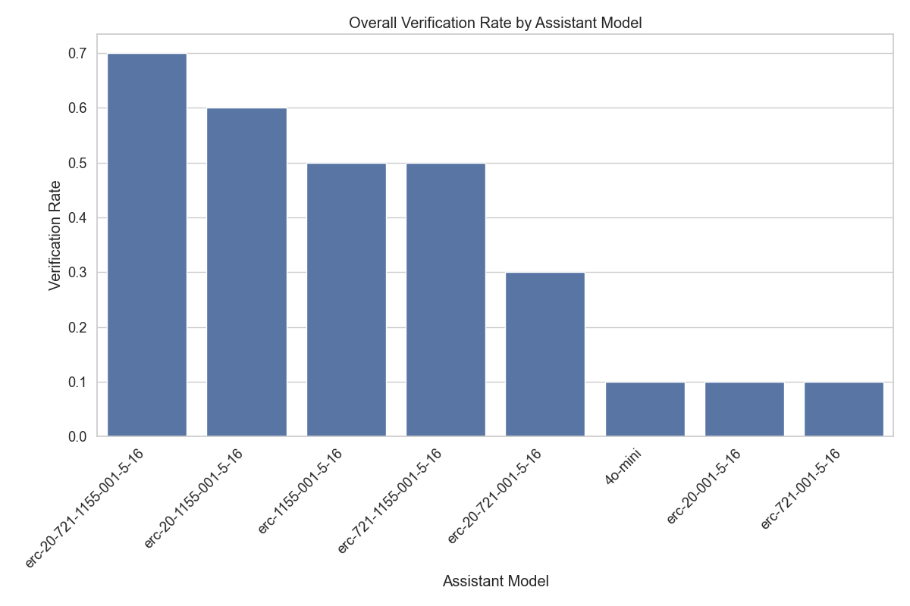
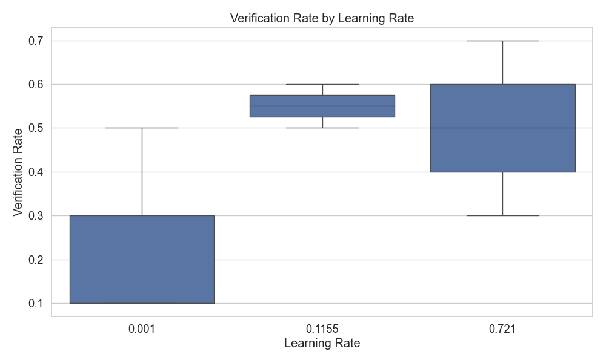
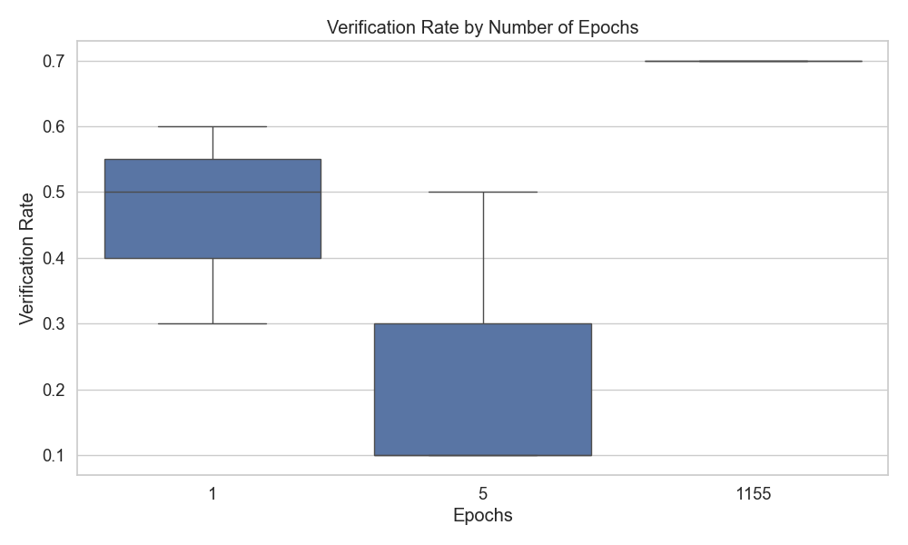
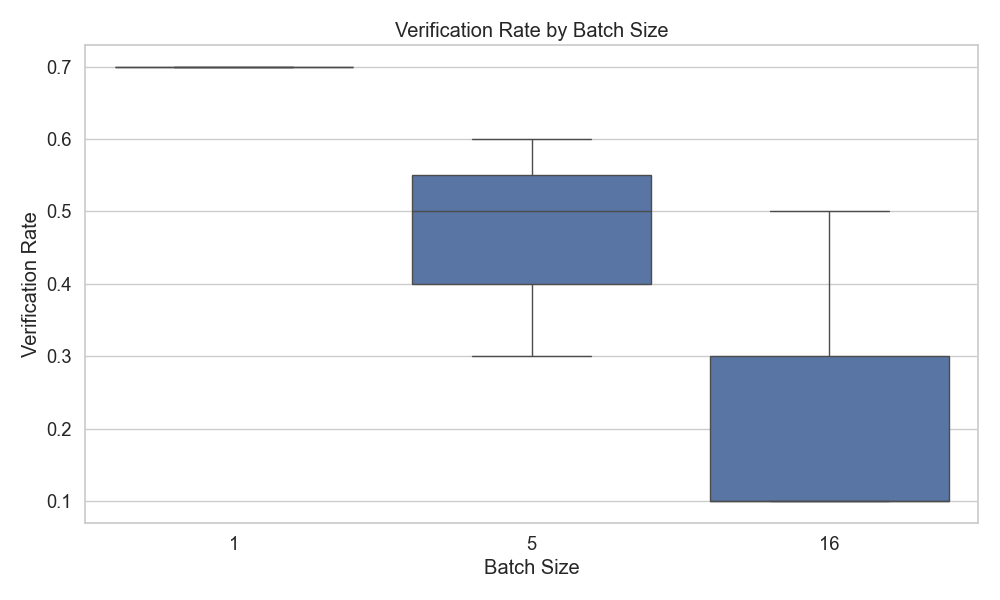

# Assistant Fine-Tuning Performance Analysis

This document summarizes the results of fine-tuning experiments for generating formal postconditions for smart contracts using different GPT models. The analysis is based on 80 total runs.

## Overall Performance Analysis

This section presents the overall success rates of each model across all tasks. Success is defined as generating postconditions that pass verification.

**Total Runs Analyzed:** 80

**Overall Success Rates:**

| model | verification_rate | verified_count | total_runs |
| :--- | :--- | :--- | :--- |
| erc-20-721-1155-001-5-16 | 70.00 | 7 | 10 |
| erc-20-1155-001-5-16 | 60.00 | 6 | 10 |
| erc-1155-001-5-16 | 50.00 | 5 | 10 |
| erc-721-1155-001-5-16 | 50.00 | 5 | 10 |
| erc-20-721-001-5-16 | 30.00 | 3 | 10 |
| 4o-mini | 10.00 | 1 | 10 |
| erc-20-001-5-16 | 10.00 | 1 | 10 |
| erc-721-001-5-16 | 10.00 | 1 | 10 |

**Key Observations:**

- The 'erc-20-721-1155-001-5-16' model achieved the highest overall success rate at 70.00%.
- The average verification rate across all models was 36.25%.
- The 'erc-721-001-5-16' model had the lowest success rate at 10.00%.

## Model Specificity Analysis

This section examines how well each model performs when requested to generate postconditions for a particular contract standard.

**Success Rate (%) for each Model on each Requested Type:**

| model | erc1155 |
| :--- | :--- |
| erc-721-1155-001-5-16 | 50.00 |
| erc-721-001-5-16 | 10.00 |
| erc-20-721-1155-001-5-16 | 70.00 |
| erc-20-721-001-5-16 | 30.00 |
| erc-20-1155-001-5-16 | 60.00 |
| erc-20-001-5-16 | 10.00 |
| erc-1155-001-5-16 | 50.00 |
| 4o-mini | 10.00 |

**Successful Runs / Total Runs for each Model on each Requested Type:**

| model | erc1155 |
| :--- | :--- |
| erc-721-1155-001-5-16 | 5 / 10 |
| erc-721-001-5-16 | 1 / 10 |
| erc-20-721-1155-001-5-16 | 7 / 10 |
| erc-20-721-001-5-16 | 3 / 10 |
| erc-20-1155-001-5-16 | 6 / 10 |
| erc-20-001-5-16 | 1 / 10 |
| erc-1155-001-5-16 | 5 / 10 |
| 4o-mini | 1 / 10 |

## Efficiency Analysis

This section evaluates the efficiency of the models in terms of the number of iterations and time taken to reach a successful verification or exhaust attempts.

**Average Iterations and Time per Model:**

| model | avg_fail_iterations | avg_success_iterations | avg_fail_time | avg_success_time | fail_rate |
| :--- | :--- | :--- | :--- | :--- | :--- |
| 4o-mini | 10.0 | 2.0 | 394.29024481773376 | 131.73115611076355 | 90.00 |
| erc-20-001-5-16 | 10.0 | 6.0 | 506.8208063973321 | 337.18719458580017 | 90.00 |
| erc-721-001-5-16 | 10.0 | 1.0 | 303.4327322906918 | 155.34373307228088 | 90.00 |
| erc-20-721-001-5-16 | 10.0 | 1.6666666666666667 | 477.40826289994374 | 128.38063486417136 | 70.00 |
| erc-1155-001-5-16 | 10.0 | 0.4 | 332.8495099544525 | 72.63426847457886 | 50.00 |
| erc-721-1155-001-5-16 | 10.0 | 1.8 | 475.6532118320465 | 188.09829206466674 | 50.00 |
| erc-20-1155-001-5-16 | 10.0 | 2.6666666666666665 | 544.839805483818 | 169.74025563398996 | 40.00 |
| erc-20-721-1155-001-5-16 | 10.0 | 2.142857142857143 | 421.9002103805542 | 144.10592917033605 | 30.00 |

## Hyperparameter Analysis

This section analyzes the impact of different hyperparameters (learning rate, epochs, batch size) on model performance.

### By Learning Rate

### By Epochs

### By Batch Size

## Function-level Verification Analysis

This section examines which specific functions are most successfully verified by each model.

## Overall Conclusion

Based on the analysis, the following conclusions can be drawn:

1. The models `erc-20-721-1155-001-5-16`, `erc-20-1155-001-5-16` and `erc-1155-001-5-16` demonstrated the highest overall verification rates.
2. Fine-tuning generally improved performance compared to the baseline `4o-mini` model (verification rate: 10.00%).
3. The optimal hyperparameters appear to be a learning rate of 0.116, 1155 epochs, and a batch size of 1.
4. Successful verification attempts are significantly faster than failed attempts, suggesting that early success indicators can help determine when a model is likely to produce valid postconditions.

*Report generated on 2025-05-30 14:35:32*
