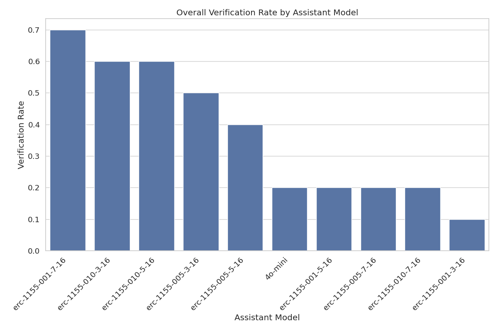
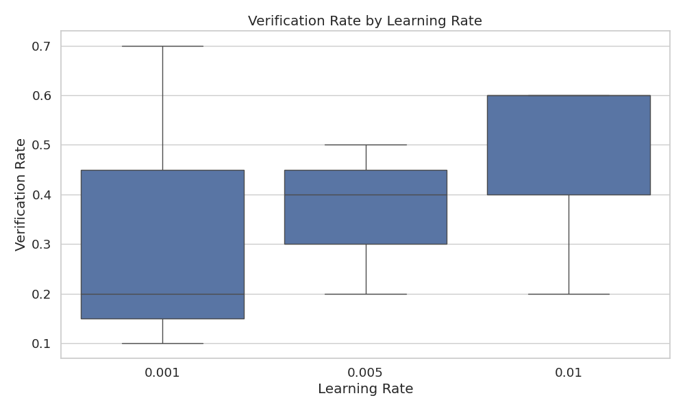
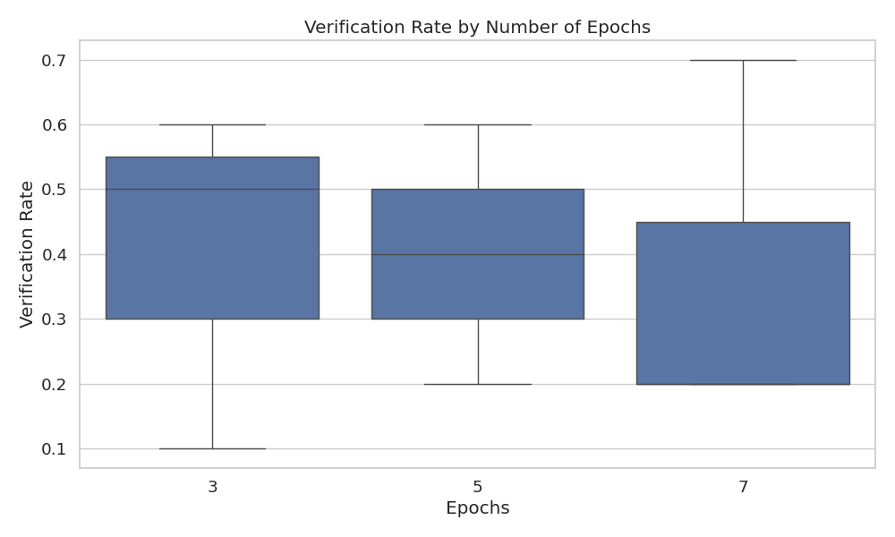
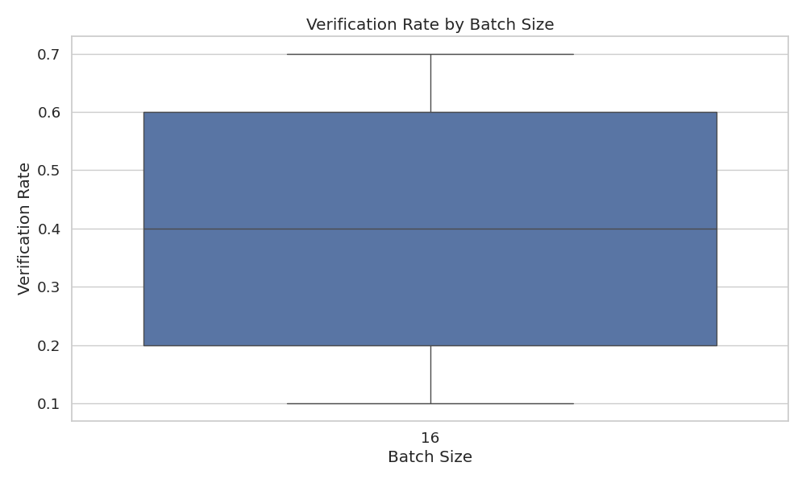

# Assistant Fine-Tuning Performance Analysis

This document summarizes the results of fine-tuning experiments for generating formal postconditions for smart contracts using different GPT models. The analysis is based on 100 total runs.

## Overall Performance Analysis

This section presents the overall success rates of each model across all tasks. Success is defined as generating postconditions that pass verification.

**Total Runs Analyzed:** 100

**Overall Success Rates:**

| model | verification_rate | verified_count | total_runs |
| :--- | :--- | :--- | :--- |
| erc-1155-001-7-16 | 70.00 | 7 | 10 |
| erc-1155-010-3-16 | 60.00 | 6 | 10 |
| erc-1155-010-5-16 | 60.00 | 6 | 10 |
| erc-1155-005-3-16 | 50.00 | 5 | 10 |
| erc-1155-005-5-16 | 40.00 | 4 | 10 |
| 4o-mini | 20.00 | 2 | 10 |
| erc-1155-001-5-16 | 20.00 | 2 | 10 |
| erc-1155-005-7-16 | 20.00 | 2 | 10 |
| erc-1155-010-7-16 | 20.00 | 2 | 10 |
| erc-1155-001-3-16 | 10.00 | 1 | 10 |

**Key Observations:**

- The 'erc-1155-001-7-16' model achieved the highest overall success rate at 70.00%.
- The average verification rate across all models was 37.00%.
- The 'erc-1155-001-3-16' model had the lowest success rate at 10.00%.

## Model Specificity Analysis

This section examines how well each model performs when requested to generate postconditions for a particular contract standard.

**Success Rate (%) for each Model on each Requested Type:**

| model | erc20 |
| :--- | :--- |
| erc-1155-010-7-16 | 20.00 |
| erc-1155-010-5-16 | 60.00 |
| erc-1155-010-3-16 | 60.00 |
| erc-1155-005-7-16 | 20.00 |
| erc-1155-005-5-16 | 40.00 |
| erc-1155-005-3-16 | 50.00 |
| erc-1155-001-7-16 | 70.00 |
| erc-1155-001-5-16 | 20.00 |
| erc-1155-001-3-16 | 10.00 |
| 4o-mini | 20.00 |

**Successful Runs / Total Runs for each Model on each Requested Type:**

| model | erc20 |
| :--- | :--- |
| erc-1155-010-7-16 | 2 / 10 |
| erc-1155-010-5-16 | 6 / 10 |
| erc-1155-010-3-16 | 6 / 10 |
| erc-1155-005-7-16 | 2 / 10 |
| erc-1155-005-5-16 | 4 / 10 |
| erc-1155-005-3-16 | 5 / 10 |
| erc-1155-001-7-16 | 7 / 10 |
| erc-1155-001-5-16 | 2 / 10 |
| erc-1155-001-3-16 | 1 / 10 |
| 4o-mini | 2 / 10 |

## Efficiency Analysis

This section evaluates the efficiency of the models in terms of the number of iterations and time taken to reach a successful verification or exhaust attempts.

**Average Iterations and Time per Model:**

| model | avg_fail_iterations | avg_success_iterations | avg_fail_time | avg_success_time | fail_rate |
| :--- | :--- | :--- | :--- | :--- | :--- |
| erc-1155-001-3-16 | 10.0 | 2.0 | 310.1737881766425 | 78.46017789840698 | 90.00 |
| 4o-mini | 10.0 | 1.5 | 296.6070077717304 | 75.37543189525604 | 80.00 |
| erc-1155-001-5-16 | 10.0 | 0.5 | 279.8856382369995 | 40.85800004005432 | 80.00 |
| erc-1155-005-7-16 | 8.75 | 1.5 | 232.97990891337395 | 68.17317497730255 | 80.00 |
| erc-1155-010-7-16 | 8.75 | 2.5 | 246.0418132841587 | 91.06719934940338 | 80.00 |
| erc-1155-005-5-16 | 10.0 | 3.75 | 294.864764213562 | 126.47356379032135 | 60.00 |
| erc-1155-005-3-16 | 10.0 | 2.4 | 302.7510801315308 | 116.84099688529969 | 50.00 |
| erc-1155-010-3-16 | 10.0 | 4.166666666666667 | 330.28510987758636 | 147.44587333997092 | 40.00 |
| erc-1155-010-5-16 | 10.0 | 3.8333333333333335 | 285.0248826146126 | 159.38762096563974 | 40.00 |
| erc-1155-001-7-16 | 10.0 | 3.2857142857142856 | 311.7308252652486 | 119.78038280350822 | 30.00 |

## Hyperparameter Analysis

This section analyzes the impact of different hyperparameters (learning rate, epochs, batch size) on model performance.

### By Learning Rate

### By Epochs

### By Batch Size

## Function-level Verification Analysis

This section examines which specific functions are most successfully verified by each model.

## Overall Conclusion

Based on the analysis, the following conclusions can be drawn:

1. The models `erc-1155-001-7-16`, `erc-1155-010-3-16` and `erc-1155-010-5-16` demonstrated the highest overall verification rates.
2. Fine-tuning generally improved performance compared to the baseline `4o-mini` model (verification rate: 20.00%).
3. The optimal hyperparameters appear to be a learning rate of 0.010, 3 epochs, and a batch size of 16.
4. Successful verification attempts are significantly faster than failed attempts, suggesting that early success indicators can help determine when a model is likely to produce valid postconditions.

*Report generated on 2025-05-25 03:42:09*
