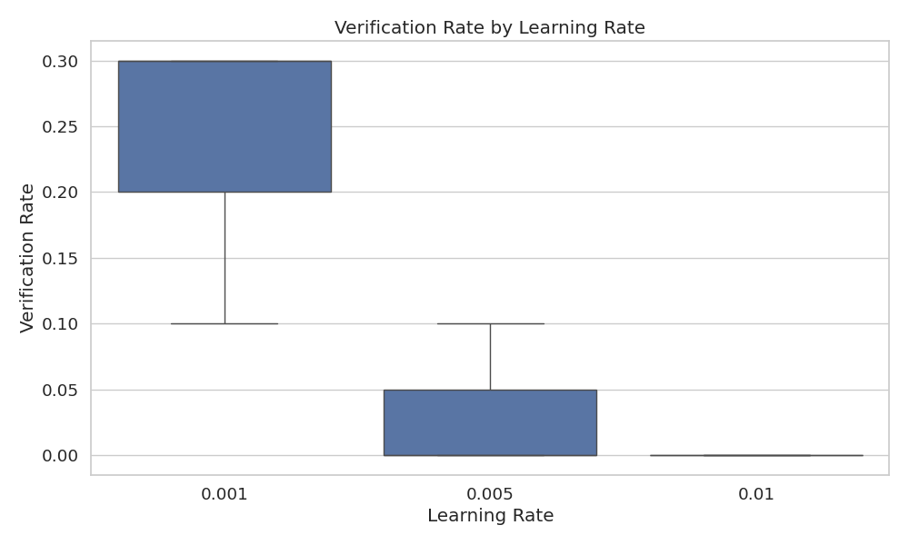
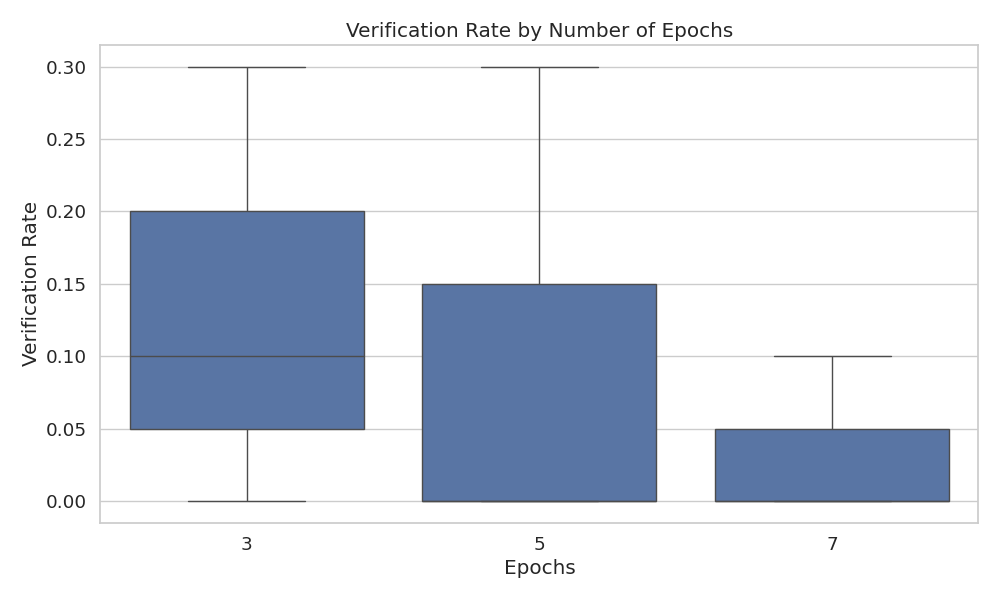
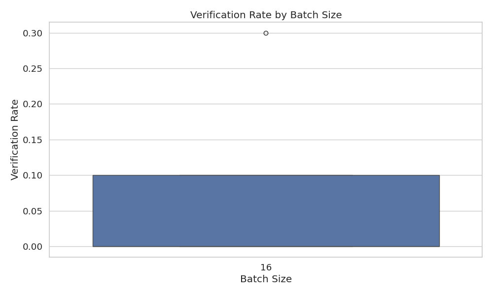

# Assistant Fine-Tuning Performance Analysis

This document summarizes the results of fine-tuning experiments for generating formal postconditions for smart contracts using different GPT models. The analysis is based on 100 total runs.

## Overall Performance Analysis

This section presents the overall success rates of each model across all tasks. Success is defined as generating postconditions that pass verification.

**Total Runs Analyzed:** 100

**Overall Success Rates:**

| model | verification_rate | verified_count | total_runs |
| :--- | :--- | :--- | :--- |
| 4o-mini | 30.00 | 3 | 10 |
| erc-1155-001-3-16 | 30.00 | 3 | 10 |
| erc-1155-001-5-16 | 30.00 | 3 | 10 |
| erc-1155-001-7-16 | 10.00 | 1 | 10 |
| erc-1155-005-3-16 | 10.00 | 1 | 10 |
| erc-1155-005-5-16 | 0.00 | 0 | 10 |
| erc-1155-005-7-16 | 0.00 | 0 | 10 |
| erc-1155-010-3-16 | 0.00 | 0 | 10 |
| erc-1155-010-5-16 | 0.00 | 0 | 10 |
| erc-1155-010-7-16 | 0.00 | 0 | 10 |

**Key Observations:**

- The '4o-mini' model achieved the highest overall success rate at 30.00%.
- The average verification rate across all models was 11.00%.
- The 'erc-1155-010-7-16' model had the lowest success rate at 0.00%.

## Model Specificity Analysis

This section examines how well each model performs when requested to generate postconditions for a particular contract standard.

**Success Rate (%) for each Model on each Requested Type:**

| model | erc721 |
| :--- | :--- |
| erc-1155-010-7-16 | 0.00 |
| erc-1155-010-5-16 | 0.00 |
| erc-1155-010-3-16 | 0.00 |
| erc-1155-005-7-16 | 0.00 |
| erc-1155-005-5-16 | 0.00 |
| erc-1155-005-3-16 | 10.00 |
| erc-1155-001-7-16 | 10.00 |
| erc-1155-001-5-16 | 30.00 |
| erc-1155-001-3-16 | 30.00 |
| 4o-mini | 30.00 |

**Successful Runs / Total Runs for each Model on each Requested Type:**

| model | erc721 |
| :--- | :--- |
| erc-1155-010-7-16 | 0 / 10 |
| erc-1155-010-5-16 | 0 / 10 |
| erc-1155-010-3-16 | 0 / 10 |
| erc-1155-005-7-16 | 0 / 10 |
| erc-1155-005-5-16 | 0 / 10 |
| erc-1155-005-3-16 | 1 / 10 |
| erc-1155-001-7-16 | 1 / 10 |
| erc-1155-001-5-16 | 3 / 10 |
| erc-1155-001-3-16 | 3 / 10 |
| 4o-mini | 3 / 10 |

## Efficiency Analysis

This section evaluates the efficiency of the models in terms of the number of iterations and time taken to reach a successful verification or exhaust attempts.

**Average Iterations and Time per Model:**

| model | avg_fail_iterations | avg_success_iterations | avg_fail_time | avg_success_time | fail_rate |
| :--- | :--- | :--- | :--- | :--- | :--- |
| erc-1155-005-5-16 | 10.0 | 0.0 | 253.00987043380738 | 0.0 | 100.00 |
| erc-1155-005-7-16 | 8.3 | 0.0 | 218.18202004432678 | 0.0 | 100.00 |
| erc-1155-010-3-16 | 9.0 | 0.0 | 244.21443984508514 | 0.0 | 100.00 |
| erc-1155-010-5-16 | 10.0 | 0.0 | 271.88993949890136 | 0.0 | 100.00 |
| erc-1155-010-7-16 | 10.0 | 0.0 | 262.6734430074692 | 0.0 | 100.00 |
| erc-1155-001-7-16 | 10.0 | 5.0 | 395.784632285436 | 203.3598747253418 | 90.00 |
| erc-1155-005-3-16 | 10.0 | 8.0 | 402.2135084470113 | 370.7291696071625 | 90.00 |
| 4o-mini | 10.0 | 5.0 | 494.73936925615584 | 289.7690637111664 | 70.00 |
| erc-1155-001-3-16 | 10.0 | 4.0 | 331.7394518852234 | 167.11883401870728 | 70.00 |
| erc-1155-001-5-16 | 10.0 | 5.666666666666667 | 348.4481887817383 | 246.8782045841217 | 70.00 |

## Hyperparameter Analysis

This section analyzes the impact of different hyperparameters (learning rate, epochs, batch size) on model performance.

### By Learning Rate

### By Epochs

### By Batch Size

## Function-level Verification Analysis

This section examines which specific functions are most successfully verified by each model.

## Overall Conclusion

Based on the analysis, the following conclusions can be drawn:

1. The models `4o-mini`, `erc-1155-001-3-16` and `erc-1155-001-5-16` demonstrated the highest overall verification rates.
2. Fine-tuning generally improved performance compared to the baseline `4o-mini` model (verification rate: 30.00%).
3. The optimal hyperparameters appear to be a learning rate of 0.001, 3 epochs, and a batch size of 16.
4. Successful verification attempts are significantly faster than failed attempts, suggesting that early success indicators can help determine when a model is likely to produce valid postconditions.

*Report generated on 2025-05-25 03:40:39*
