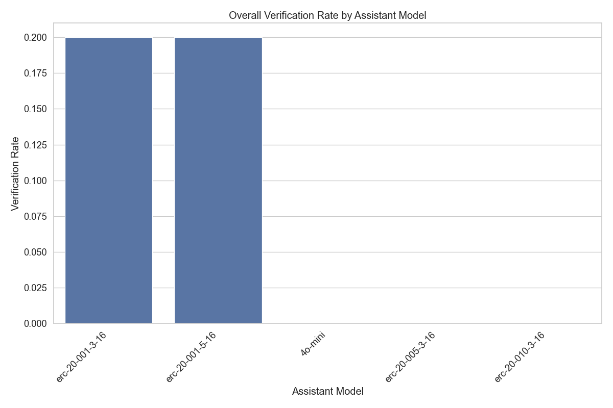
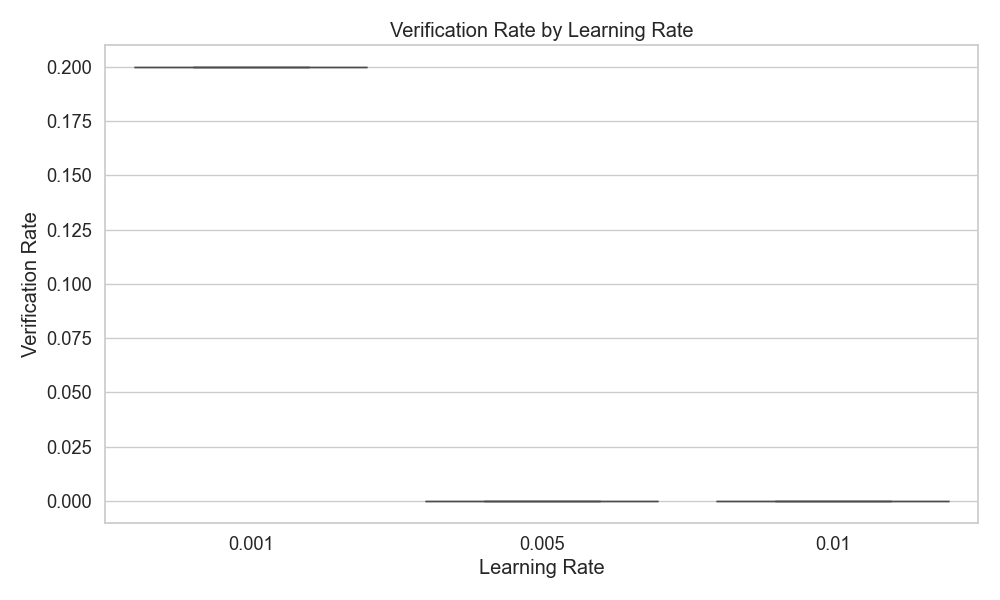
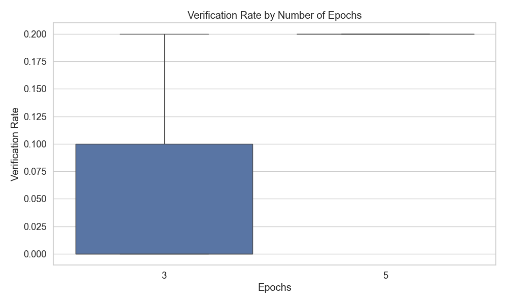
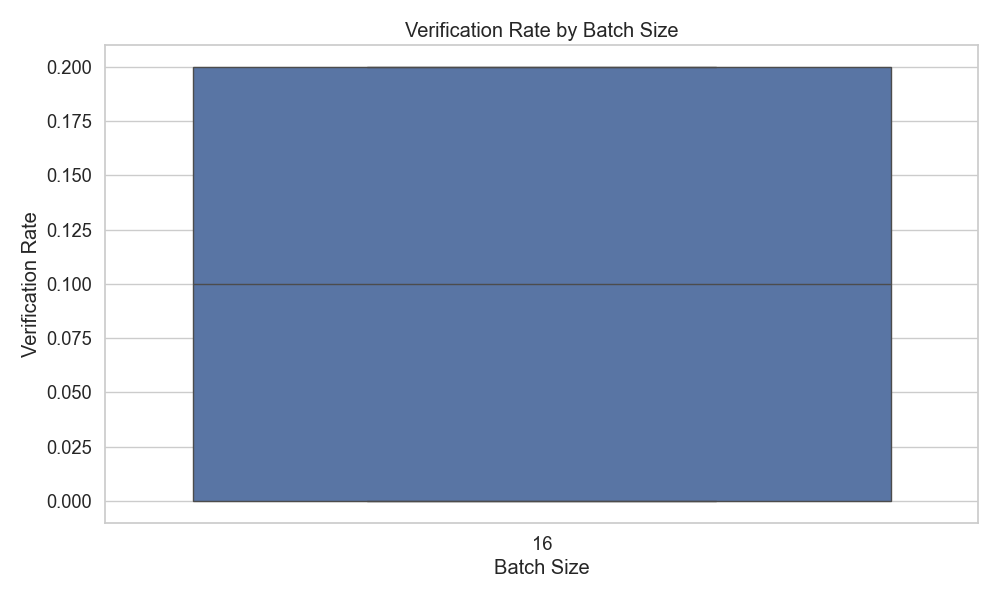

# Assistant Fine-Tuning Performance Analysis

This document summarizes the results of fine-tuning experiments for generating formal postconditions for smart contracts using different GPT models. The analysis is based on 50 total runs.

## Overall Performance Analysis

This section presents the overall success rates of each model across all tasks. Success is defined as generating postconditions that pass verification.

**Total Runs Analyzed:** 50

**Overall Success Rates:**

| model | verification_rate | verified_count | total_runs |
| :--- | :--- | :--- | :--- |
| erc-20-001-3-16 | 20.00 | 2 | 10 |
| erc-20-001-5-16 | 20.00 | 2 | 10 |
| 4o-mini | 0.00 | 0 | 10 |
| erc-20-005-3-16 | 0.00 | 0 | 10 |
| erc-20-010-3-16 | 0.00 | 0 | 10 |

**Key Observations:**

- The 'erc-20-001-3-16' model achieved the highest overall success rate at 20.00%.
- The average verification rate across all models was 8.00%.
- The 'erc-20-010-3-16' model had the lowest success rate at 0.00%.

## Model Specificity Analysis

This section examines how well each model performs when requested to generate postconditions for a particular contract standard.

**Success Rate (%) for each Model on each Requested Type:**

| model | erc1155 |
| :--- | :--- |
| erc-20-010-3-16 | 0.00 |
| erc-20-005-3-16 | 0.00 |
| erc-20-001-5-16 | 20.00 |
| erc-20-001-3-16 | 20.00 |
| 4o-mini | 0.00 |

**Successful Runs / Total Runs for each Model on each Requested Type:**

| model | erc1155 |
| :--- | :--- |
| erc-20-010-3-16 | 0 / 10 |
| erc-20-005-3-16 | 0 / 10 |
| erc-20-001-5-16 | 2 / 10 |
| erc-20-001-3-16 | 2 / 10 |
| 4o-mini | 0 / 10 |

## Efficiency Analysis

This section evaluates the efficiency of the models in terms of the number of iterations and time taken to reach a successful verification or exhaust attempts.

**Average Iterations and Time per Model:**

| model | avg_fail_iterations | avg_success_iterations | avg_fail_time | avg_success_time | fail_rate |
| :--- | :--- | :--- | :--- | :--- | :--- |
| 4o-mini | 10.0 | 0.0 | 319.9581855297089 | 0.0 | 100.00 |
| erc-20-005-3-16 | 9.5 | 0.0 | 240.6758842945099 | 0.0 | 100.00 |
| erc-20-010-3-16 | 10.0 | 0.0 | 305.50177862644193 | 0.0 | 100.00 |
| erc-20-001-3-16 | 9.0 | 1.5 | 294.1133488416672 | 96.59028351306915 | 80.00 |
| erc-20-001-5-16 | 10.0 | 5.0 | 296.80451089143753 | 175.0191774368286 | 80.00 |

## Hyperparameter Analysis

This section analyzes the impact of different hyperparameters (learning rate, epochs, batch size) on model performance.

### By Learning Rate

### By Epochs

### By Batch Size

## Function-level Verification Analysis

This section examines which specific functions are most successfully verified by each model.

## Overall Conclusion

Based on the analysis, the following conclusions can be drawn:

1. The models `erc-20-001-3-16`, `erc-20-001-5-16` and `4o-mini` demonstrated the highest overall verification rates.
2. Fine-tuning generally improved performance compared to the baseline `4o-mini` model (verification rate: 0.00%).
3. The optimal hyperparameters appear to be a learning rate of 0.001, 5 epochs, and a batch size of 16.
4. Successful verification attempts are significantly faster than failed attempts, suggesting that early success indicators can help determine when a model is likely to produce valid postconditions.

*Report generated on 2025-05-23 15:09:53*
