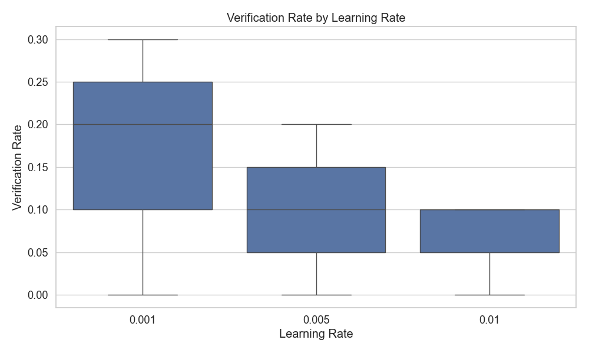

# Assistant Fine-Tuning Performance Analysis

This document summarizes the results of fine-tuning experiments for generating formal postconditions for smart contracts using different GPT models. The analysis is based on 90 total runs.

## Overall Performance Analysis

This section presents the overall success rates of each model across all tasks. Success is defined as generating postconditions that pass verification.

**Total Runs Analyzed:** 90

**Overall Success Rates:**

| model | verification_rate | verified_count | total_runs |
| :--- | :--- | :--- | :--- |
| erc-20-001-7-16 | 30.00 | 3 | 10 |
| erc-20-001-3-16 | 20.00 | 2 | 10 |
| erc-20-005-5-16 | 20.00 | 2 | 10 |
| erc-20-005-7-16 | 10.00 | 1 | 10 |
| erc-20-010-3-16 | 10.00 | 1 | 10 |
| erc-20-010-7-16 | 10.00 | 1 | 10 |
| erc-20-001-5-16 | 0.00 | 0 | 10 |
| erc-20-005-3-16 | 0.00 | 0 | 10 |
| erc-20-010-5-16 | 0.00 | 0 | 10 |

**Key Observations:**

- The 'erc-20-001-7-16' model achieved the highest overall success rate at 30.00%.
- The average verification rate across all models was 11.11%.
- The 'erc-20-010-5-16' model had the lowest success rate at 0.00%.

## Model Specificity Analysis

This section examines how well each model performs when requested to generate postconditions for a particular contract standard.

**Success Rate (%) for each Model on each Requested Type:**

| model | erc20 |
| :--- | :--- |
| erc-20-010-7-16 | 10.00 |
| erc-20-010-5-16 | 0.00 |
| erc-20-010-3-16 | 10.00 |
| erc-20-005-7-16 | 10.00 |
| erc-20-005-5-16 | 20.00 |
| erc-20-005-3-16 | 0.00 |
| erc-20-001-7-16 | 30.00 |
| erc-20-001-5-16 | 0.00 |
| erc-20-001-3-16 | 20.00 |

**Successful Runs / Total Runs for each Model on each Requested Type:**

| model | erc20 |
| :--- | :--- |
| erc-20-010-7-16 | 1 / 10 |
| erc-20-010-5-16 | 0 / 10 |
| erc-20-010-3-16 | 1 / 10 |
| erc-20-005-7-16 | 1 / 10 |
| erc-20-005-5-16 | 2 / 10 |
| erc-20-005-3-16 | 0 / 10 |
| erc-20-001-7-16 | 3 / 10 |
| erc-20-001-5-16 | 0 / 10 |
| erc-20-001-3-16 | 2 / 10 |

## Efficiency Analysis

This section evaluates the efficiency of the models in terms of the number of iterations and time taken to reach a successful verification or exhaust attempts.

**Average Iterations and Time per Model:**

| model | avg_fail_iterations | avg_success_iterations | avg_fail_time | avg_success_time | fail_rate |
| :--- | :--- | :--- | :--- | :--- | :--- |
| erc-20-001-5-16 | 9.8 | 0.0 | 302.2282150030136 | 0.0 | 100.00 |
| erc-20-005-3-16 | 9.1 | 0.0 | 231.21887645721435 | 0.0 | 100.00 |
| erc-20-010-5-16 | 10.0 | 0.0 | 240.4399954557419 | 0.0 | 100.00 |
| erc-20-005-7-16 | 10.0 | 8.0 | 315.3078022003174 | 285.34713673591614 | 90.00 |
| erc-20-010-3-16 | 9.88888888888889 | 5.0 | 234.90976360109119 | 207.2230851650238 | 90.00 |
| erc-20-010-7-16 | 8.777777777777779 | 7.0 | 222.12461140420703 | 230.37199330329895 | 90.00 |
| erc-20-001-3-16 | 9.25 | 5.5 | 268.4585976600647 | 204.7268806695938 | 80.00 |
| erc-20-005-5-16 | 10.0 | 5.5 | 293.66166281700134 | 232.8861721754074 | 80.00 |
| erc-20-001-7-16 | 10.0 | 3.6666666666666665 | 276.6267649105617 | 143.06720678011575 | 70.00 |

## Hyperparameter Analysis

This section analyzes the impact of different hyperparameters (learning rate, epochs, batch size) on model performance.

### By Learning Rate

### By Epochs

### By Batch Size

## Function-level Verification Analysis

This section examines which specific functions are most successfully verified by each model.

## Overall Conclusion

Based on the analysis, the following conclusions can be drawn:

1. The models `erc-20-001-7-16`, `erc-20-001-3-16` and `erc-20-005-5-16` demonstrated the highest overall verification rates.
