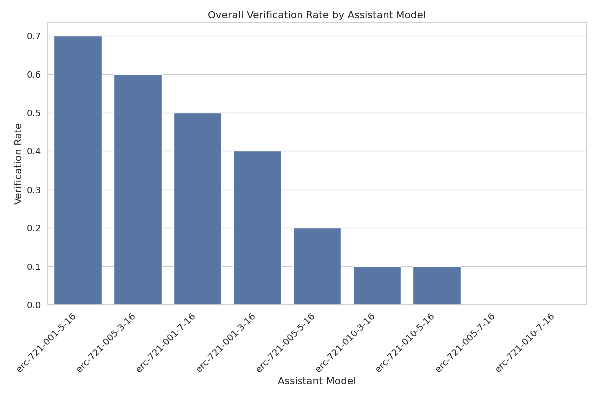
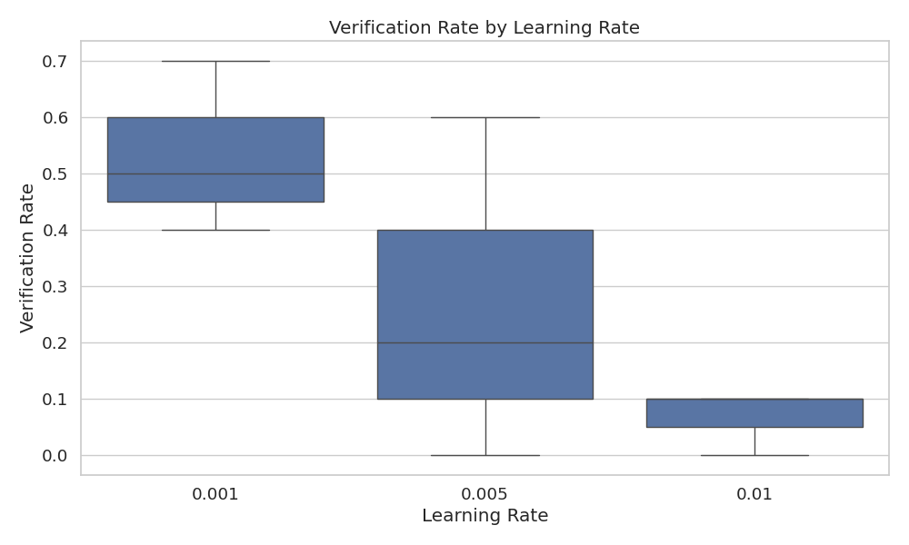
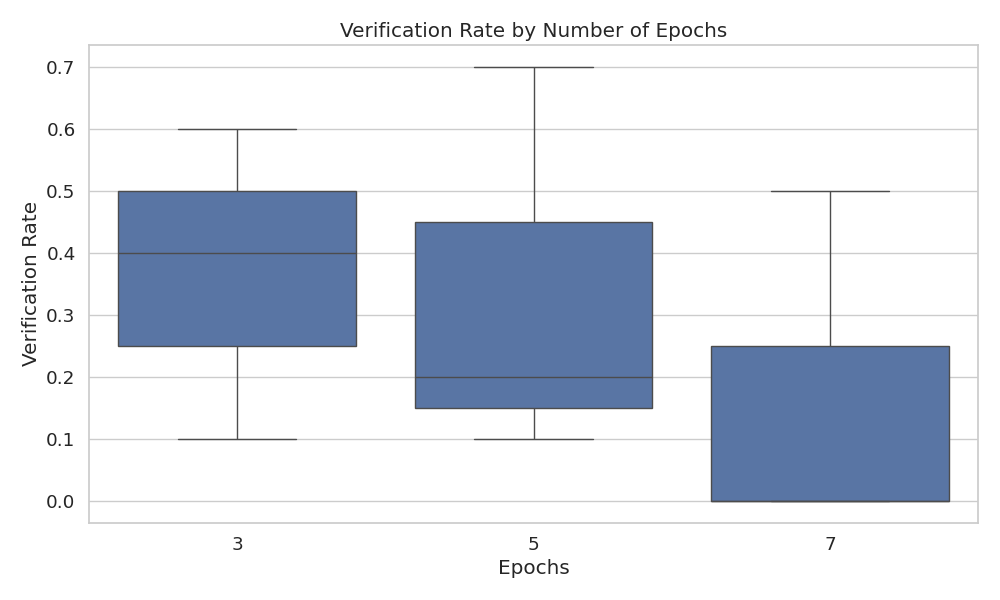
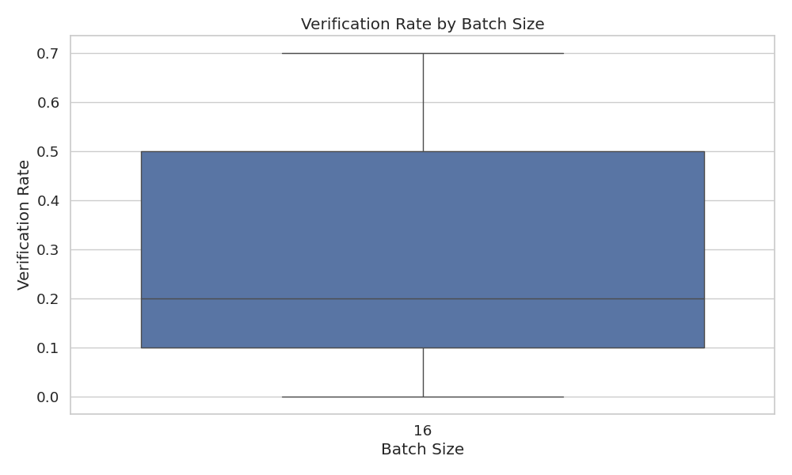

# Assistant Fine-Tuning Performance Analysis

This document summarizes the results of fine-tuning experiments for generating formal postconditions for smart contracts using different GPT models. The analysis is based on 90 total runs.

## Overall Performance Analysis

This section presents the overall success rates of each model across all tasks. Success is defined as generating postconditions that pass verification.

**Total Runs Analyzed:** 90

**Overall Success Rates:**

| model | verification_rate | verified_count | total_runs |
| :--- | :--- | :--- | :--- |
| erc-721-001-5-16 | 70.00 | 7 | 10 |
| erc-721-005-3-16 | 60.00 | 6 | 10 |
| erc-721-001-7-16 | 50.00 | 5 | 10 |
| erc-721-001-3-16 | 40.00 | 4 | 10 |
| erc-721-005-5-16 | 20.00 | 2 | 10 |
| erc-721-010-3-16 | 10.00 | 1 | 10 |
| erc-721-010-5-16 | 10.00 | 1 | 10 |
| erc-721-005-7-16 | 0.00 | 0 | 10 |
| erc-721-010-7-16 | 0.00 | 0 | 10 |

**Key Observations:**

- The 'erc-721-001-5-16' model achieved the highest overall success rate at 70.00%.
- The average verification rate across all models was 28.89%.
- The 'erc-721-010-7-16' model had the lowest success rate at 0.00%.

## Model Specificity Analysis

This section examines how well each model performs when requested to generate postconditions for a particular contract standard.

**Success Rate (%) for each Model on each Requested Type:**

| model | erc721 |
| :--- | :--- |
| erc-721-010-7-16 | 0.00 |
| erc-721-010-5-16 | 10.00 |
| erc-721-010-3-16 | 10.00 |
| erc-721-005-7-16 | 0.00 |
| erc-721-005-5-16 | 20.00 |
| erc-721-005-3-16 | 60.00 |
| erc-721-001-7-16 | 50.00 |
| erc-721-001-5-16 | 70.00 |
| erc-721-001-3-16 | 40.00 |

**Successful Runs / Total Runs for each Model on each Requested Type:**

| model | erc721 |
| :--- | :--- |
| erc-721-010-7-16 | 0 / 10 |
| erc-721-010-5-16 | 1 / 10 |
| erc-721-010-3-16 | 1 / 10 |
| erc-721-005-7-16 | 0 / 10 |
| erc-721-005-5-16 | 2 / 10 |
| erc-721-005-3-16 | 6 / 10 |
| erc-721-001-7-16 | 5 / 10 |
| erc-721-001-5-16 | 7 / 10 |
| erc-721-001-3-16 | 4 / 10 |

## Efficiency Analysis

This section evaluates the efficiency of the models in terms of the number of iterations and time taken to reach a successful verification or exhaust attempts.

**Average Iterations and Time per Model:**

| model | avg_fail_iterations | avg_success_iterations | avg_fail_time | avg_success_time | fail_rate |
| :--- | :--- | :--- | :--- | :--- | :--- |
| erc-721-005-7-16 | 10.0 | 0.0 | 169.1622358560562 | 0.0 | 100.00 |
| erc-721-010-7-16 | 10.0 | 0.0 | 179.81627030372618 | 0.0 | 100.00 |
| erc-721-010-3-16 | 10.0 | 8.0 | 169.39699292182922 | 272.53233575820923 | 90.00 |
| erc-721-010-5-16 | 10.0 | 3.0 | 186.02434243096246 | 80.29780101776123 | 90.00 |
| erc-721-005-5-16 | 10.0 | 2.5 | 261.33892649412155 | 87.87080550193787 | 80.00 |
| erc-721-001-3-16 | 8.833333333333334 | 4.0 | 278.79567444324493 | 170.22052764892578 | 60.00 |
| erc-721-001-7-16 | 10.0 | 2.8 | 242.0356800556183 | 88.47604103088379 | 50.00 |
| erc-721-005-3-16 | 10.0 | 3.5 | 167.3076941370964 | 84.1889460881551 | 40.00 |
| erc-721-001-5-16 | 10.0 | 2.0 | 317.72359768549603 | 92.58783105441502 | 30.00 |

## Hyperparameter Analysis

This section analyzes the impact of different hyperparameters (learning rate, epochs, batch size) on model performance.

### By Learning Rate

### By Epochs

### By Batch Size

## Function-level Verification Analysis

This section examines which specific functions are most successfully verified by each model.

## Overall Conclusion

Based on the analysis, the following conclusions can be drawn:

1. The models `erc-721-001-5-16`, `erc-721-005-3-16` and `erc-721-001-7-16` demonstrated the highest overall verification rates.
